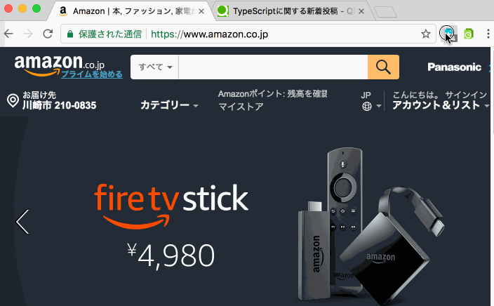

# in-site-extensions

Chrome/Firefox WebExtensions that shows bookmarks/histories on current sites.

## In-Site Bookmark

Simple in-site bookmark manager.

* [In-Site Bookmark - Chrome WebStore](https://chrome.google.com/webstore/detail/in-site-bookmark/mpleiaoobkcpaedlgmpnlohojkbjgfbj)
* [In-Site Bookmark – Add-ons for Firefox](https://addons.mozilla.org/en-US/firefox/addon/in-site-bookmark/)

## In-Site History

You can view histories only on current site.

* [In-Site History - Chrome WebStore](https://chrome.google.com/webstore/detail/in-site-history/jhcjfcakhkchbcchegiaifdcdadnopie?hl=ja)
* [In-Site History – Add-ons for Firefox](https://addons.mozilla.org/en-US/firefox/addon/in-site-history/)